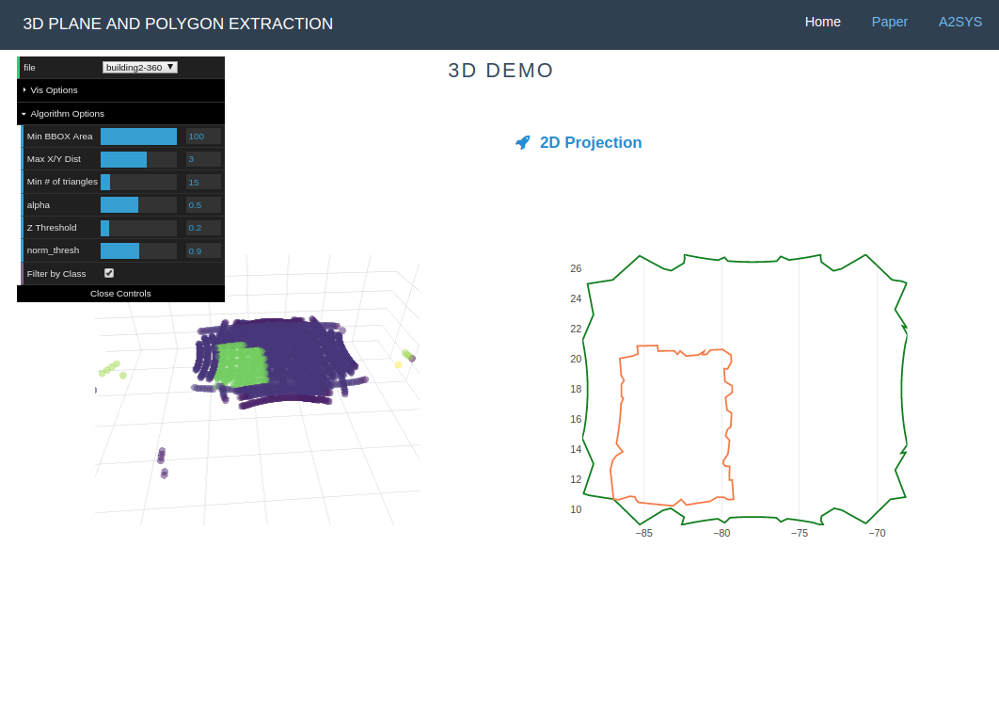

# Polylidar V2

Polylidar allows one to extract planar meshes from a point cloud **and** their 2D projected polygons. The point cloud can be in 2, 3, or 4 dimensions (XY, XYZ, XYZC=Class). This module is written in C++ and is built as a python plugin.  A Typescript (javascript) version is also created as well.

The image below is polylidar (Typescript/Website version) with a classified point cloud data set.  A point cloud of a building roof (purple dots) and a tarp (green) dots are seen on the left.  The extracted polygon of the roof is seen on the right. The green line represents the concave hull of the extracted mesh, and the orange lines represent *holes* in the polygon.




Much of this work is possible because of the amazing library called [delaunator](https://github.com/delfrrr/delaunator-cpp).  It provides a very fast 2D delaunay triangulation that outputs a data structure that is perfectly suitable for this work. All the triangles are indexed by [half-edges](https://mapbox.github.io/delaunator/) allowing the quick extraction and polygon generation of any planar meshes.


## Robust Geometric Predicates

Delaunator does not use [robust geometric predicates](https://github.com/mikolalysenko/robust-arithmetic-notes) for its orientation and incircle tests; [reference](https://github.com/mapbox/delaunator/issues/43).  This means that the triangulation can be incorrect when points are nearly colinear or cocircular. A library developed by Jonathan Richard Shewchuk provides very fast adaptive precision floating point arithmetic for [geometric predicates](https://www.cs.cmu.edu/~quake/robust.html).  This library is released in the public domain and an updated version of it is maintained at this [repository](https://github.com/danshapero/predicates). I have included this source code in the folder `polylidar/predicates`.  

If you desire to have robust geometric predicates built into Polylidar you must set an environment variable, "USE_ROBUST_PREDICATES=1". The python file `setup.py` will read this environment variable and then include the robust geometric predicates into the build process. Without setting this variable none of the `pedicates` source code is included in the binary distribution.


## Installing

1. Install [conda](https://conda.io/projects/conda/en/latest/) - [Why?](https://medium.freecodecamp.org/why-you-need-python-environments-and-how-to-manage-them-with-conda-85f155f4353c)
2. `conda install -c conda-forge pybind11`
3. `conda install shapely` - Only needed for windows binary dependency
3. `python setup.py build install`

Please run the tests to ensure everything is working. Pytest should be installed as it is listed as a dependency.

1. Simply type `pytest` to run tests

## Demo

You can see a demo in action py running `python tests/visualize.py`. Requires `matplotlib descartes`.

## API

What are the inputs to the code?  The input arguments are a **contiguous** numpy array with length N and 2,3,or 4 columns depending on your data.  There are also configuration options as well that you can pass as keyword arguments.


What are the inputs?

* points - Numpy array
* Optional - 2D Triangle Filtering
  * alpha (double) - The maximum circumradius of a triangle.
  * lmax (double) - Maximum edge length of any edge in a triangle
* Optional - 3D Triangle Filtering
  * normalVector ([double, double, double]) - NOT IMPLEMENTED. Currently fixed to [0,0,1]. The normal vector of the planar mesh(s) you desire to extract.
  * normalThresh (double) - Any triangle whose `abs(normalVector * triangleNormal) > normalThresh` is filtered
  * zThresh (double) - Normal filtering is ignored if the the "height" of a triangle is less than zThresh. Parameter to reduce filtering in noisy pointclouds. 
* Optional - Plane Filtering
  * minTriangles (int) - Any planar mesh who has less than this quantity of triangles will not be returned
* Optional - Triangle Filtering by Class (4th Dimension)
  * allowedClass (double) - Will filter out triangles whose vertices are not classified the same as allowedClass

What are the outputs?

* Delaunay - This is a C++ class data structure that has information about your triangles, half edges, and point indices. Read more [here](https://mapbox.github.io/delaunator/).
* planes - This is a *list* of C++ *vectors* holding `ints`. Each vector is an extracted plane.  The `ints` correspond to triangle indices.
* polygons - This is a *list* of C++ `polygon` data structure.
* polygon - This is a struct that has two fields: shell and holes. Shell is a *vector* of `ints`, where each int represents a *point* index. Holes is a list of a vector of `ints`. Each vector represents a hole in the polygon.

Example calls
```python
from polylidar import extractPlanesAndPolygons, extractPolygons, Delaunator

# You want everything!
delaunay, planes, polygons = extractPlanesAndPolygons(point_cloud:ndarray)

# Show me JUST the polygons!
polygons = extractPolygons(point_cloud:ndarray)

# Also if you just want fast 2D delaunay triangulation, no polylidar
delaunay = Delaunator(point_cloud:ndarray)
```


## Benchmark

```
----------------------------------------------------------------------------------- benchmark: 4 tests ----------------------------------------------------------------------------------
Name (time in ms)            Min                Max               Mean            StdDev             Median               IQR            Outliers       OPS            Rounds  Iterations
-----------------------------------------------------------------------------------------------------------------------------------------------------------------------------------------
test_bad_convex_hull      1.2780 (1.0)       2.0440 (1.0)       1.2879 (1.0)      0.0388 (1.0)       1.2824 (1.0)      0.0034 (1.0)         17;40  776.4774 (1.0)         767           1
test_building1            2.1215 (1.66)      2.7847 (1.36)      2.1386 (1.66)     0.0397 (1.02)      2.1336 (1.66)     0.0051 (1.48)         8;31  467.5944 (0.60)        404           1
test_building2            2.4713 (1.93)      3.2301 (1.58)      2.4957 (1.94)     0.0627 (1.61)      2.4811 (1.93)     0.0054 (1.58)        21;62  400.6942 (0.52)        399           1
test_100k_array          50.2531 (39.32)    52.2024 (25.54)    50.7566 (39.41)    0.4435 (11.42)    50.6749 (39.51)    0.1969 (57.50)         5;5   19.7019 (0.03)         20           1
-----------------------------------------------------------------------------------------------------------------------------------------------------------------------------------------

Legend:
  Outliers: 1 Standard Deviation from Mean; 1.5 IQR (InterQuartile Range) from 1st Quartile and 3rd Quartile.
  OPS: Operations Per Second, computed as 1 / Mean
======================================================================================== 107 passed, 1 warnings in 15.70 seconds =========================================================================================
```

## Issues

- [X] If there are coincident points then it seems the delaunator cpp library gets stuck in an infinite loop (sometimes?). Add a very small amount of noise to the data (jitter) to ensure this doesn't happen.
  - Patched delaunator, no need to add jitter. https://github.com/mapbox/delaunator/pull/49
- [X] Polylidar makes heavy use of hashmaps. Try a better hashmap than std::unordered_map
  - Add robinhood hashing as direct replacement for std::unorderd_map. Polylidar is now 30% faster.
- [X] Improper triangulation because of floating point inaccuracies
  - Added geometric predicates for those have this issue. 20% speed reduction.
- [X] 3D extension improvement. If 3D point clouds are denser (close spacing in x,y) than sensor noise there are issues. The zThresh parameter is now larger (because of noise) than the spacing which causes the normal threshold bypassing.
  - Added additional normThreshMin parameter which if is not satisfied will automatically filter triangle.  ZThresh will no affect for normal filtering bypass.


