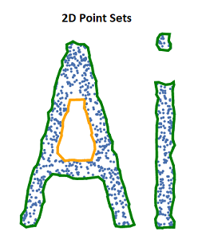
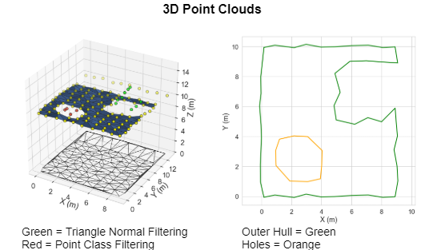

<h1 align="center">
  Polylidar
  <br>
</h1>

<h4 align="center">Polygon Extraction from 2D and 3D Point Clouds</h4>

<p align="center">
  <a href="#key-features">Key Features</a> •
  <a href="#install">Install</a> •
  <a href="#how-to-use">How To Use</a> •
  <a href="#polylidar-use-cases">Use Cases</a> •
  <a href="#credits">Credits</a> •
  <a href="#related-methods">Related</a> •
  <a href="#license">License</a>
</p>

<p align="middle">
  
   
</p>


## Key Features

* Fast (Multi)Polygon Extraction from 2D and 3D point clouds 
  - Written in C++ for portability
  - Extremely fast. 100,000 3D point cloud takes ~130ms to process on laptop
  - Polygons with holes may be returned
* Python3 bindings using PyBind11
  - Low overhead for calling python/cpp interface (no copying of point cloud data)
* Python and C++ Examples
* Cross platform
  - Windows and Linux ready.

Polylidar allows one to extract planar meshes from a point cloud **and** their polygon representations. The point cloud can be in 2, 3, or 4 dimensions (XY, XYZ, XYZC=Class). This module is written in C++ and can be used as a python module or standalone with a C++ project. Note the **lidar** in Poly**lidar** is a misnomer; it works with any point cloud, not just from LiDAR sensors.

## Install

### Python

Polylidar is not on PyPI so it must be installed manually.

1. Install [conda](https://conda.io/projects/conda/en/latest/) or create a python virtual envrionment ([Why?](https://medium.freecodecamp.org/why-you-need-python-environments-and-how-to-manage-them-with-conda-85f155f4353c)). I recommend conda for Windows users.
2. `conda install shapely` - Only for Windows users because conda handles windows binary dependency correctly.
3. `pip install -e ".[dev]"`
4. `pytest` - OPTIONAL, this will run a series of tests and benchmarks.

### C++

See `examples/cpp` for how to build.

### Robust Geometric Predicates

Delaunator does not use [robust geometric predicates](https://github.com/mikolalysenko/robust-arithmetic-notes) for its orientation and incircle tests; [reference](https://github.com/mapbox/delaunator/issues/43).  This means that the triangulation can be incorrect when points are nearly colinear or cocircular. A library developed by Jonathan Richard Shewchuk provides very fast adaptive precision floating point arithmetic for [geometric predicates](https://www.cs.cmu.edu/~quake/robust.html).  This library is released in the public domain and an updated version of it is maintained at this [repository](https://github.com/danshapero/predicates). I have included this source code in the folder `polylidar/predicates`.  

If you desire to have robust geometric predicates built into Polylidar you must set an environment variable, "PL_USE_ROBUST_PREDICATES=1" (-DPL_USE_ROBUST_PREDICATES for C++). The python file `setup.py` will read this environment variable and then include the robust geometric predicates into the build process. Without setting this variable none of the `predicates` source code is included in the python plugin.


## How To Use

You can see a demo in action py running `python examples/python/basic2d.py`. More Python and C++ examples can be found in the `examples` folder.

Function exposed:

```python
from polylidar import extractPlanesAndPolygons, extractPolygons, Delaunator

kwargs = dict(alpha=0.0, lmax=1.0)

# You want everything!
delaunay, planes, polygons = extractPlanesAndPolygons(point_cloud, **kwargs)

# Show me JUST the polygons!
polygons = extractPolygons(point_cloud, **kwargs)

# Also if you just want fast 2D delaunay triangulation, no polylidar
delaunay = Delaunator(point_cloud)
```

### API (WIP to improve documentation)

What are the inputs to the code?  The input arguments are a **contiguous** numpy array with length N and 2,3,or 4 columns depending on your data.  There are also configuration options as well that you can pass as keyword arguments.


What are the inputs?

* points - Numpy array
* Required - 2D Triangle Filtering
  * alpha (double, default=1.0) - The maximum circumradius of a triangle.
  * lmax (double,default=0.0 [inactive]) - Maximum edge length of any edge in a triangle. i.e. maximum point distance for spatial connectivity.
* Optional - 3D Triangle Filtering (normal filtering aka planarity constraints)
  * normalVector ([double, double, double]) - NOT IMPLEMENTED. Currently fixed to [0,0,1]. The normal vector of the planar mesh(s) you desire to extract.
  * normThresh (double, default=0.9) - Any triangle whose `abs(normalVector * triangleNormal) < normThresh` is filtered
  * zThresh (double,default=0.2) - Normal filtering is ignored (bypassed) if the the "height" (dz) of a triangle is less than zThresh. This is used to attenuate false-positive filtering in noisy pointclouds. 
  * normThreshMin (double, default=0.1) - Any triangle whose `abs(normalVector * triangleNormal) < normThreshMin` is filtered. This take priority over anything else, even zThresh bypass. Think of this as the bare minimum of flatness a triangle must have to remain in the mesh.
* Optional - 3D Plane Filtering
  * minTriangles (int) - Any planar mesh who has less than this quantity of triangles will not be returned
* Optional - Triangle Filtering by Class (4th Dimension)
  * allowedClass (double) - Will filter out triangles whose vertices are not classified the same as allowedClass

What are the outputs?

* Delaunay - This is a C++ class data structure that has information about your triangles, half edges, and point indices. Read more [here](https://mapbox.github.io/delaunator/).
* planes - This is a *list* of C++ *vectors* holding `ints`. Each vector is an extracted plane.  The `ints` correspond to triangle indices.
* polygons - This is a *list* of C++ `polygon` data structure.
* polygon - This is a struct that has two fields: shell and holes. Shell is a *vector* of `ints`, where each int represents a *point* index. Holes is a list of a *vector* of `ints`. Each vector represents a hole in the polygon.


## Polylidar Use Cases

- [Polylidar-RealSense](https://github.com/JeremyBYU/polylidar-realsense) - Live ground floor detection with Intel RealSense camera using Polylidar
- [PolylidarWeb](https://github.com/JeremyBYU/polylidarweb). A Typescript (javascript) version with live demos.
- [Concave-Evaluation](https://github.com/JeremyBYU/concavehull-evaluation) - Evaluates and benchmarks several competing concavehull algorithms.


## Credits

This software uses the following open source packages:

- [Delaunator](https://github.com/mapbox/delaunator) - Original triangulation library
- [DelaunatorCPP](https://github.com/delfrrr/delaunator-cpp) - Delaunator ported to C++ (used)
- [parallel-hashmap](https://github.com/greg7mdp/parallel-hashmap) - Very fast hashmap library (used)
- [PyBind11](https://github.com/pybind/pybind11) - Python C++ Binding (used)
- [Robust Geometric Predicates](https://www.cs.cmu.edu/~quake/robust.html) - Original Robust Geometric predicates
- [Updated Predicates](https://github.com/danshapero/predicates) -Updated geometric predicate library (used)

## Related Methods

- [CGAL Alpha Shapes](https://doc.cgal.org/latest/Alpha_shapes_2/index.html) - MultiPolygon with holes.
- [PostGIS ConcaveHull](http://postgis.net/docs/ST_ConcaveHull.html) - Single Polygon with holes.
- [Spatialite ConcaveHull](https://www.gaia-gis.it/fossil/libspatialite/wiki?name=tesselations-4.0) - MultiPolygon with holes.
- [Concaveman](https://github.com/mapbox/concaveman) - A 2D concave hull extraction algorithm for 2D point sets.

## License

MIT

---

> GitHub [@jeremybyu](https://github.com/JeremyBYU)
