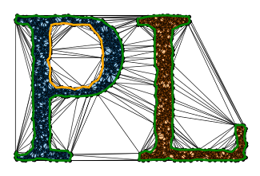
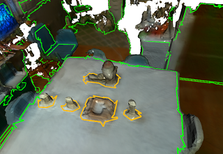

<h1 align="center">
  Polylidar3D
  <br>
</h1>

<h4 align="center">Polygon Extraction from 2D Point Sets, Unorganized/Organized 3D Point Clouds, and Triangular Meshes</h4>

<p align="center">
  <a href="#key-features">Key Features</a> •
  <a href="#documentation-and-branches">Documentation</a> •
  <a href="#polylidar-use-cases">Use Cases</a> •
  <a href="#credits">Credits</a> •
  <a href="#related-methods">Related</a> •
  <a href="#citation">Citations</a> •
  <a href="#license">License</a>
</p>

<p align="middle">
  
   
  <!-- 
    -->
</p>

[](https://jeremybyu.github.io/polylidar/)
[](https://ieeexplore.ieee.org/document/9117017)
[](https://www.mdpi.com/1424-8220/20/17/4819)

## Key Features

* Fast (Multi)Polygon Extraction from multiple sources of 3D Data
  * Written in C++ for portability
  * Extremely fast single-threaded but includes CPU multi-threading using data and task-based parallelism
  * Polygons with holes may be returned
* Python3 bindings using PyBind11
  * Low overhead for calling python/cpp interface (no copying of point cloud data)
* Python and C++ Examples
  * Examples from 2D Point Sets, Unorganized 3D point clouds, Organized 3D point clouds (i.e., range images), and user provided meshes
* Cross platform
  * Windows and Linux ready.

Polylidar3D is a non-convex polygon extraction algorithm which takes as input either unorganized 2D point sets, unorganized 3D point clouds (e.g., airborne LiDAR point clouds), organized 3D point clouds (e.g., range images), or user provided meshes. In 3D, the non-convex polygons extracted represent flat surfaces in an environment, while interior holes represent obstacles on said surfaces. The picture above provides an examples of Polylidar3D extracting polygons from a 2D point set and a 3D triangular mesh; green is the concave hull and orange are interior holes. Polylidar3D outputs *planar* triangular segments and their polygonal representations. Polylidar3D is extremely fast, taking as little as a few milliseconds and makes use of CPU multi-threading and GPU acceleration when available.

Here is a small introductory blog-post about [Polylidar3D](https://robosim.dev/posts/polylidar/).

## Documentation and Branches

Please see [documentation](https://jeremybyu.github.io/polylidar/) for installation, api, and examples. Note that Polylidar went though major changes in July 2020 for 3D work, now called `Polylidar3D`. The old repository for 2D work (and some *basic* 3D) is found in the branch [polylidar2D](https://github.com/JeremyBYU/polylidar/tree/polylidar2d) and is connected to this [paper](https://ieeexplore.ieee.org/document/9117017). `Polylidar3D` can still handle 2D point sets but the API is different and not the focus of this repo. For papers referencing Polylidar2D and Polylidar3D please see <a href="#citation">Citations</a>. 

*Eventually* I am going to make a standalone cpp/header file for 2D point set -> polygon extraction for those that don't need any of the features of `Polylidar3D`. 

## Polylidar Use Cases

* [Polylidar-RealSense](https://github.com/JeremyBYU/polylidar-realsense) - Live ground floor detection with Intel RealSense camera using Polylidar
* [Polylidar-KITTI](https://github.com/JeremyBYU/polylidar-kitti) - Street surface and obstacle detection from autonomous driving platform.
* [PolylidarWeb](https://github.com/JeremyBYU/polylidarweb). An very old Typescript (javascript) version with live demos of Polylidar2D.
* [Concave-Evaluation](https://github.com/JeremyBYU/concavehull-evaluation) - Evaluates and benchmarks several competing concavehull algorithms.

## Credits

This software is only possible because of the great work from the following open source packages:

* [Delaunator](https://github.com/mapbox/delaunator) - Original triangulation library 
* [DelaunatorCPP](https://github.com/delfrrr/delaunator-cpp) - Delaunator ported to C++ (used)
* [parallel-hashmap](https://github.com/greg7mdp/parallel-hashmap) - Very fast hashmap library (used)
* [PyBind11](https://github.com/pybind/pybind11) - Python C++ Binding (used)
* [Robust Geometric Predicates](https://www.cs.cmu.edu/~quake/robust.html) - Original Robust Geometric predicates
* [Updated Predicates](https://github.com/danshapero/predicates) -Updated geometric predicate library (used)

## Related Methods

### 2D ConcaveHull Extraction

* [CGAL Alpha Shapes](https://doc.cgal.org/latest/Alpha_shapes_2/index.html) - MultiPolygon with holes.
* [PostGIS ConcaveHull](http://postgis.net/docs/ST_ConcaveHull.html) - Single Polygon with holes.
* [Spatialite ConcaveHull](https://www.gaia-gis.it/fossil/libspatialite/wiki?name=tesselations-4.0) - MultiPolygon with holes.
* [Concaveman](https://github.com/mapbox/concaveman) - A 2D concave hull extraction algorithm for 2D point sets.


## Contributing

Any help or suggestions would be appreciated!

## Citation

### 2D

If are using Polylidar for 2D work please cite: 

J. Castagno and E. Atkins, "Polylidar - Polygons From Triangular Meshes," in IEEE Robotics and Automation Letters, vol. 5, no. 3, pp. 4634-4641, July 2020, doi: 10.1109/LRA.2020.3002212.
[Link to Paper](https://ieeexplore.ieee.org/document/9117017)

```
@ARTICLE{9117017,
  author={J. {Castagno} and E. {Atkins}},
  journal={IEEE Robotics and Automation Letters}, 
  title={Polylidar - Polygons From Triangular Meshes}, 
  year={2020},
  volume={5},
  number={3},
  pages={4634-4641}
}
```

### 3D

If you are using Polylidar3D for 3D work please cite:

J. Castagno and E. Atkins, "Polylidar3D - Fast Polygon Extraction from 3D Data," in MDPI Sensors, vol. 20, no.17, 4819, September 2020, doi: 10.3390/s20174819
[Link to Paper](https://www.mdpi.com/1424-8220/20/17/4819)

```
@Article{s20174819,
AUTHOR = {Castagno, Jeremy and Atkins, Ella},
TITLE = {Polylidar3D-Fast Polygon Extraction from 3D Data},
JOURNAL = {Sensors},
VOLUME = {20},
YEAR = {2020},
NUMBER = {17},
ARTICLE-NUMBER = {4819},
URL = {https://www.mdpi.com/1424-8220/20/17/4819},
ISSN = {1424-8220}
}
```


## License

MIT

---

> GitHub [@jeremybyu](https://github.com/JeremyBYU)

