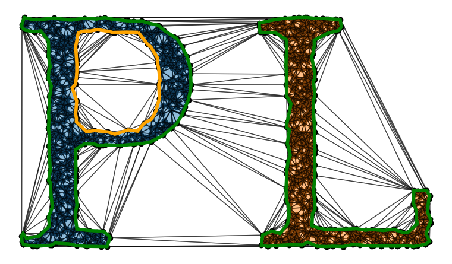

.. Polylidar3D documentation master file, created by
   sphinx-quickstart on Mon Apr  3 14:18:28 2017.
   You can adapt this file completely to your liking, but it should at least
   contain the root `toctree` directive.

-----------

Polylidar3D: Fast Polygon Extraction from 2D & 3D Data
========================================================

.. only: not latex

    Contents:

.. _gettting_started_index:

.. toctree::
    :maxdepth: 1
    :caption: Getting Started

    introduction
    install_instructions
    builddocs

.. _tutorial_index:

.. toctree::
    :maxdepth: 1
    :caption: Tutorial

    tutorial/Python/index
    tutorial/C++/index

.. _python_api_index:

.. toctree::
    :maxdepth: 1
    :caption: Python API

    python_api/polylidar
    python_api/polylidar.polylidarutil.plane_filtering

..
    Please put the module and meta data you want here!
    MAKE_DOCS/python_api/polylidar
    MAKE_DOCS/python_api/polylidar.polylidarutil.plane_filtering   python_only

.. _cpp_api_index:

.. toctree::
    :maxdepth: 1
    :caption: C++ API

    cpp_api/cpp_library_root
